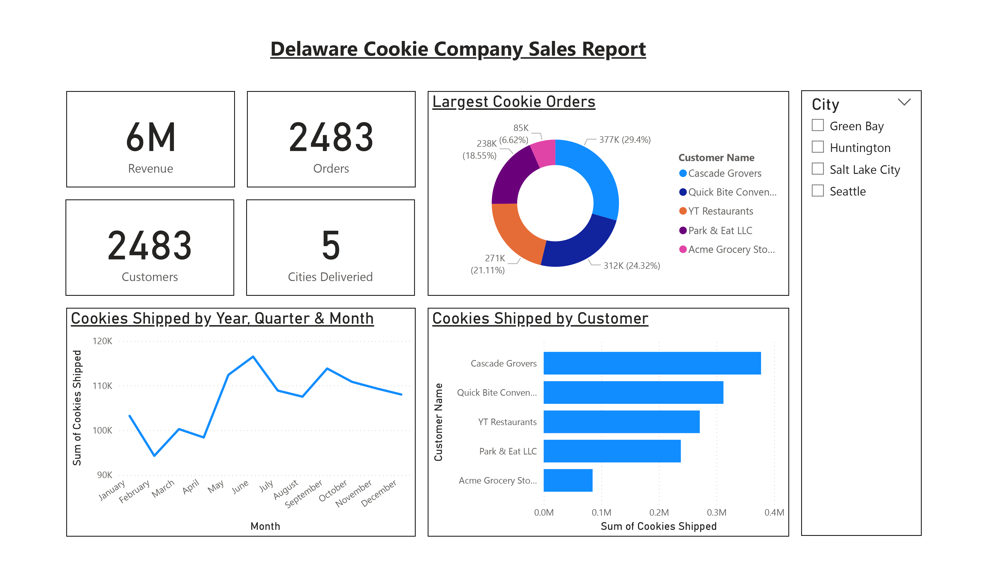

# 📊 Delaware Cookie Company Sales Report - Insights

## Overview
The Delaware Cookie Company generated **$6M** in revenue from **2,483 orders**, serving **2,483 customers** across **5 cities**. This indicates a **one-to-one order-to-customer ratio**, suggesting a **B2B (business-to-business) model** rather than direct-to-consumer sales.

## 🔍 Key Findings

### 1️⃣ Customer & Order Analysis
#### **Top Customers (Bulk Buyers):**
- **Cascade Growers** - $238K (6.62%)
- **Quick Bite Convenience** - $37TK (29.4%)
- **YT Restaurants** - $27TK (21.11%)

These three customers account for **~57% of total revenue**, indicating **high dependency on a few key accounts**. Smaller buyers include **Park & Eat LLC** and **Acme Grocery Store**.

**🔹 Recommendation:** Strengthen relationships with top clients while **diversifying the customer base** to reduce risk.

### 2️⃣ Geographic Reach
- **Cities Served:** Green Bay, Huntington, Salt Lake City, Seattle (one city name is missing).
- No clear breakdown of sales per city, but **Seattle and Salt Lake City** (larger markets) likely drive higher volumes.

**🔹 Recommendation:** Expand distribution to additional cities or **increase penetration in existing markets**.

### 3️⃣ Seasonal & Monthly Trends
#### **Peak Shipping Months:**
- **Highest in March** (~120K revenue)
- **Gradual decline post-March**, with another possible spike in **December (holiday season)**.
- **Monday is a key shipping day**.

**🔹 Recommendation:**
- Boost **marketing/promotions in slower months (April–November)**.
- Optimize **logistics for Monday shipments** to meet demand efficiently.

### 4️⃣ Sales Performance by Customer
- **Cascade Growers** is the largest buyer (~0.4M cookies shipped).
- **Quick Bite Convenience** and **YT Restaurants** follow.
- **Park & Eat LLC** and **Acme Grocery Store** contribute minimally.

**🔹 Recommendation:**
- Upsell to **mid-tier customers** (e.g., Quick Bite, YT Restaurants).
- Investigate why **smaller buyers (Park & Eat, Acme) order less**—could be pricing, product fit, or awareness.

## 📈 Strategic Recommendations

### **Customer Retention & Expansion**
- Introduce **loyalty discounts or bulk-order incentives** for top clients.
- Target **similar businesses** (e.g., other regional grocers, restaurant chains).

### **Seasonal Promotions**
- **Summer/fall** cookie varieties to counter the **post-March dip**.
- **Holiday-themed bundles** in November/December.

### **Operational Efficiency**
- Optimize **Monday shipping schedules** to handle peak demand.
- Explore **automation** if order volume grows.

### **Geographic Growth**
- Expand to nearby cities (e.g., **Portland, Denver**).
- Analyze **delivery costs** to ensure profitability in new markets.

## 📊 Conclusion
Delaware Cookie Company has a **strong B2B model** with a few **high-value customers** driving most revenue. 

To enhance growth and **reduce dependency on key accounts**, the company should:
- **Diversify the customer base**
- **Optimize shipping schedules**
- **Expand geographically**

**Seasonal strategies** and **targeted promotions** can help stabilize revenue throughout the year.

## 🔜 Next Steps:
- Conduct **customer surveys** to understand buying behavior.
- Analyze **profit margins per customer** to prioritize high-value accounts.
- Test **new markets** with limited pilot deliveries.
